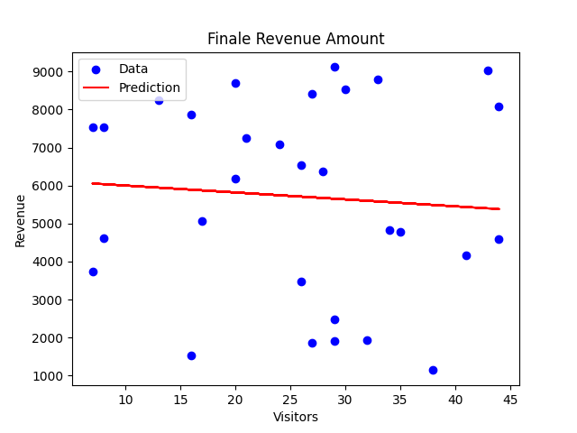

Проєкт "Аналіз спортивної команди"
Опис проєкту:
Проєкт допомагає зрозуміти, як тренування впливають 
на результати гри команди, а також розподілити 
гравців за їхніми здібностями, щоб оптимізувати тренувальний процес.

1. Лінійна регресія: Прогноз очок у грі
Мета:
Прогнозувати кількість очок команди залежно від часу тренувань.

Дані:

Training Hours (Години тренувань).
Game Points (Очки у грі).
 
Приклад:

2. Кластеризація: Розподіл гравців за здібностями
Мета:
Групувати гравців за їхніми фізичними та ігровими показниками:

Speed (Швидкість).
Stamina (Витривалість).

Результат:
Гравці розподілені в 3 категорії:

- Швидкі та витривалі.
- Середні за характеристиками.
- Низька швидкість і витривалість.

------------------------------------------------------------------------------

Проєкт "Аналіз відвідувачів кафе"

Опис проєкту: Цей проєкт досліджує взаємозв’язок 
між кількістю відвідувачів кафе та доходом, 
а також дозволяє сегментувати відвідувачів за 
їхньою поведінкою (частота візитів і середня сума 
замовлення).

1. Лінійна регресія: Прогноз доходу кафе

Лінійна регресія допомагає передбачити дохід кафе, 
якщо є дані про кількість відвідувачів.

Мета: Прогнозувати дохід кафе залежно від кількості 
відвідувачів.

Дані:

Visitors (Кількість відвідувачів на день).

Revenue (Дохід у гривнях).

Результат: Модель передбачає, як змінюється 
дохід кафе залежно від кількості відвідувачів.

Приклад:

2. Кластеризація: Сегментація відвідувачів

Кластеризація дозволяє зрозуміти, які типи клієнтів 
відвідують кафе (регулярні відвідувачі, випадкові 
тощо).

Мета: Розподілити відвідувачів кафе на групи за 
їхньою поведінкою:

Frequency (Частота візитів).

Average Spend (Середній чек).

Результат: Відвідувачі згруповані в 3 категорії, 
наприклад:

Регулярні клієнти з високим чеком.

Рідкі клієнти з середнім чеком.

Випадкові клієнти з низьким чеком.